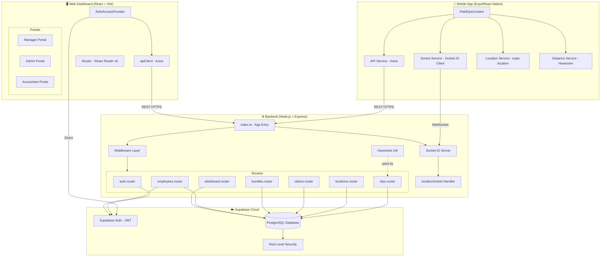
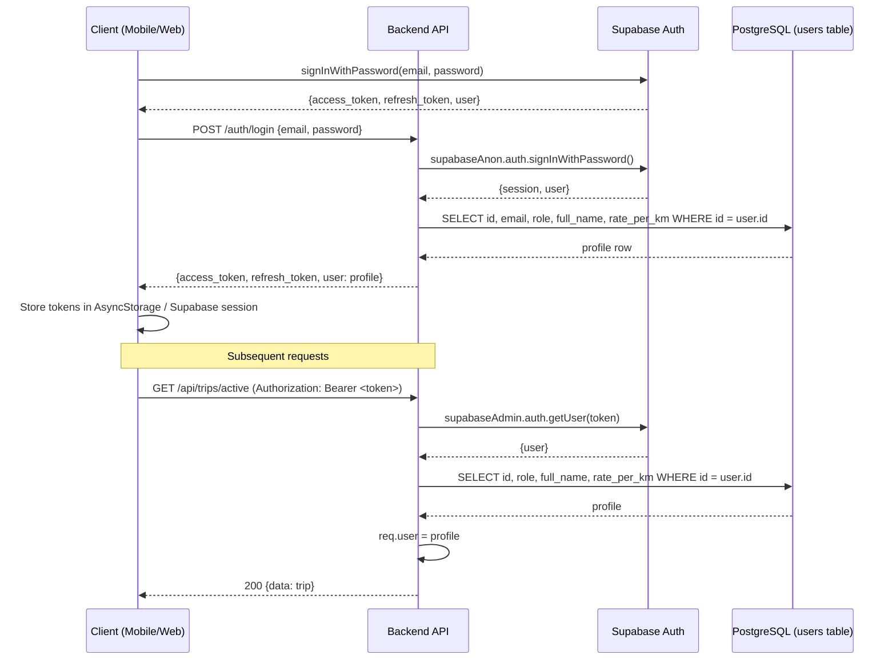
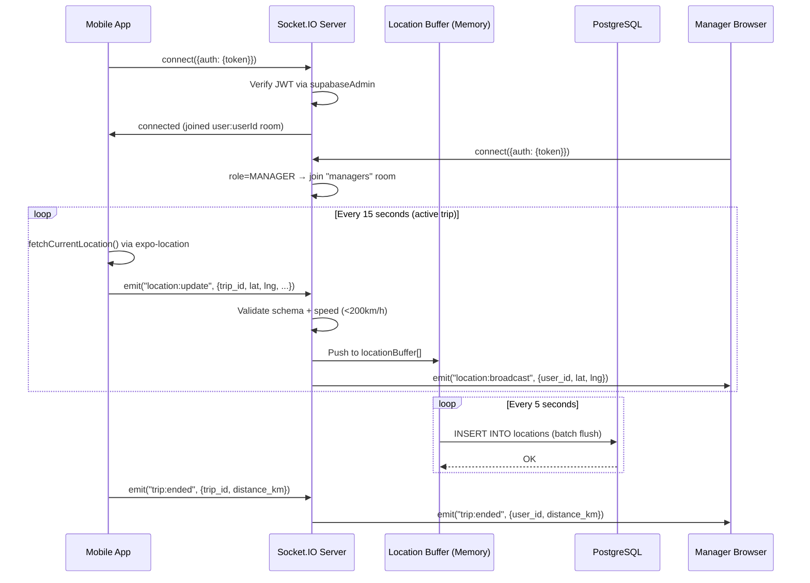

# Section 4: System Architecture

## 4.1 Overall Architecture Description

FieldOps follows a **3-tier client-server architecture** with an additional real-time channel:

```
┌─────────────────────────────────────────────────────────┐
│                     CLIENT TIER                         │
│  ┌─────────────────────┐   ┌─────────────────────────┐  │
│  │  Mobile App (Expo)  │   │  Web Dashboard (Vite)   │  │
│  │  - Employee UX      │   │  - Manager Portal       │  │
│  │  - GPS Tracking     │   │  - Admin Portal         │  │
│  │  - Claims Submit    │   │  - Accountant Portal    │  │
│  └──────────┬──────────┘   └──────────────┬──────────┘  │
└─────────────┼────────────────────────────-┼─────────────┘
              │ HTTPS REST + WebSocket       │ HTTPS REST
┌─────────────▼──────────────────────────── ▼─────────────┐
│                    APPLICATION TIER                      │
│            Node.js + Express + Socket.IO                 │
│  ┌─────────────────────────────────────────────────────┐ │
│  │  Middleware: Helmet, CORS, Rate Limit, Authenticate │ │
│  ├──────────┬──────────┬──────────┬────────┬───────────┤ │
│  │  /auth   │  /trips  │/locations│/claims │/employees │ │
│  │  /dashboard         │/bundles  │        │           │ │
│  └──────────┴──────────┴──────────┴────────┴───────────┘ │
│            Socket.IO Server (location rooms)             │
└─────────────────────────┬───────────────────────────────┘
                          │ Supabase-JS SDK
┌─────────────────────────▼───────────────────────────────┐
│                      DATA TIER                          │
│              Supabase (PostgreSQL + Auth)                │
│  ┌──────────────────────────────────────────────────┐   │
│  │  users │ trips │ locations │ claims │ bundles     │   │
│  │  employee_manager_assignments │ system_settings   │   │
│  │  Row Level Security Policies                      │   │
│  └──────────────────────────────────────────────────┘   │
└─────────────────────────────────────────────────────────┘
```

---

## 4.2 Mermaid Architecture Diagram



---

## 4.3 Client-Server Interaction

### Mobile App → Backend
| Action | Channel | Endpoint |
|---|---|---|
| Login | REST POST | `/auth/login` |
| Start trip | REST POST | `/api/trips/start` |
| Pause/resume trip | REST PATCH | `/api/trips/:id/pause|resume` |
| Stream GPS (real-time) | WebSocket | `location:update` event |
| Batch upload GPS | REST POST | `/api/locations/batch` |
| End trip | REST POST | `/api/trips/:id/end` |
| Submit bundle | REST PATCH | `/api/bundles/:id/submit` |
| Fetch dashboard | REST GET | `/api/dashboard/employee` |

### Web Dashboard → Backend
| Action | Channel | Endpoint |
|---|---|---|
| Login | Direct Supabase SDK | Supabase Auth |
| Get employees | REST GET | `/api/employees` |
| Approve claim | REST PATCH | `/api/claims/:id/approve` |
| Receive location | WebSocket | `location:broadcast` event |
| Admin create user | REST POST | `/api/employees/create` |
| Admin assign manager | REST POST | `/api/employees/assignments` |

---

## 4.4 Authentication Flow



---

## 4.5 Real-Time Communication Flow



---

## 4.6 Monorepo Structure

The project uses a **monorepo with independent package.json** files per workspace (not Turborepo/Nx-managed). There is a `shared/` directory for shared TypeScript types (compiled separately). This is a pragmatic structure for a small team but lacks automated cross-workspace build orchestration.

```
FieldOps/
├── app/          ← Expo React Native (Employee mobile app)
├── backend/      ← Node.js Express API
├── web/          ← Vite React (Manager/Admin/Accountant dashboard)
├── shared/       ← Shared TypeScript types (dist/)
├── docs/         ← Project documentation
└── report/       ← Generated analysis report (this)
```
