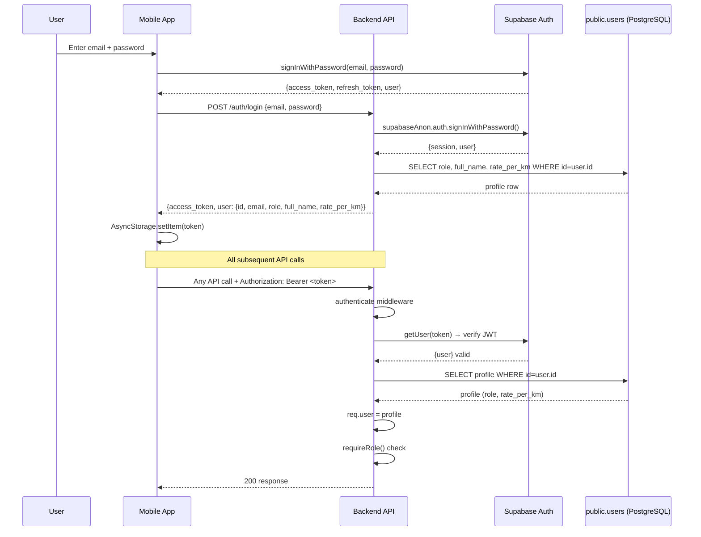

# Section 7: Authentication and Authorization

## 7.1 Supabase Auth Workflow

FieldOps uses a **hybrid authentication model** combining Supabase Auth for identity management with a custom backend layer for role-based access:



---

## 7.2 Dual Authentication Channels

The mobile app uses **two simultaneous auth channels**:

| Channel | Purpose | Token Storage |
|---|---|---|
| Supabase SDK direct | Session persistence, auto-refresh | Supabase internal (SecureStore via Expo) |
| Backend API via Axios | All custom REST calls | `AsyncStorage` (`fieldops_token`) |

Both channels use the same JWT token issued by Supabase Auth. The `FieldOpsContext.tsx` synchronizes both on login:
1. Calls `supabase.auth.signInWithPassword()` → gets session
2. Stores `session.access_token` + `session.refresh_token` in AsyncStorage
3. Axios interceptor reads from AsyncStorage for all API calls

On 401 responses, the Axios interceptor automatically calls `/auth/refresh` to get a new token.

---

## 7.3 JWT Token Flow

```
Token issued by: Supabase Auth (RS256 signed)
Token lifetime: ~1 hour (configurable in Supabase)
Refresh token lifetime: ~30 days

Backend verification:
  supabaseAdmin.auth.getUser(token)  ← validates against Supabase's JWKS endpoint
  
Payload structure (Supabase standard):
  {
    sub: "user-uuid",
    email: "user@example.com",
    role: "authenticated",
    user_metadata: { full_name, role },
    exp: timestamp
  }
```

**Important**: The `role` field in the JWT payload is Supabase's built-in role (`authenticated`/`anon`), NOT the application role (EMPLOYEE/MANAGER/ADMIN). The application role is stored in `public.users.role` and fetched separately in the `authenticate` middleware on every request.

---

## 7.4 Role-Based Access Control (RBAC)

### Role Definitions

| Role | Description | Can Do |
|---|---|---|
| `EMPLOYEE` | Field worker with mobile app | Start trips, view own data, submit claims |
| `MANAGER` | Supervises employees | View/approve assigned employee data, create/override claims |
| `ADMIN` | System administrator | All manager permissions + user management + assignments |
| `ACCOUNTANT` | Finance team | Read-only financial view of all approved claims/bundles |

### RBAC Implementation

```typescript
// Middleware stack pattern:
router.patch("/:id/approve",
  authenticate,         // Verifies JWT, attaches req.user
  requireRole("MANAGER", "ADMIN"),  // Checks req.user.role
  handler
);
```

### Role Permission Matrix

| Endpoint | EMPLOYEE | MANAGER | ADMIN | ACCOUNTANT |
|---|---|---|---|---|
| `GET /api/trips/history` | Own only | — | — | — |
| `GET /api/trips/employee/:id` | ❌ | ✅ | ✅ | ❌ |
| `GET /api/claims` | Own only | Assigned employees | All | — |
| `PATCH /api/claims/:id/approve` | ❌ | ✅ | ✅ | ❌ |
| `GET /api/bundles/manager` | ❌ | ✅ | ✅ | ❌ |
| `GET /api/employees/all` | ❌ | ❌ | ✅ | ❌ |
| `POST /api/employees/create` | ❌ | ❌ | ✅ | ❌ |
| `GET /api/dashboard/employee` | ✅ | ✅ | ✅ | ❌ |
| `GET /api/dashboard/manager` | ❌ | ✅ | ✅ | ❌ |
| `GET /api/dashboard/admin` | ❌ | ❌ | ✅ | ❌ |
| `GET /api/dashboard/accountant` | ❌ | ❌ | ✅ | ✅ |
| `GET /api/claims/:id` | Own only | Assigned | All | All |

### Manager Scoping
Managers only see **assigned employees** — those linked via `employee_manager_assignments` where `active=true`. This prevents cross-team data leakage. ADMIN users bypass assignment checks and see all employees.

---

## 7.5 Fallback Authentication Behavior

If a user exists in Supabase Auth but NOT in `public.users` (e.g., during migration or trigger failure), the `authenticate` middleware falls back to `user_metadata`:

```typescript
// authenticate.ts fallback
req.user = {
  id: supabaseUser.id,
  email: supabaseUser.email ?? "",
  role: supabaseUser.user_metadata?.role ?? "EMPLOYEE",
  full_name: supabaseUser.user_metadata?.full_name ?? email.split("@")[0],
  rate_per_km: null,
};
```

This prevents login failures but means the user operates with potentially stale metadata. **Recommendation**: Add a health-check that alerts if `public.users` is missing rows for known auth users.

---

## 7.6 Web Dashboard Auth (Critical Security Issue)

The web dashboard's `useRoleAccess.tsx` has a significant security flaw:

```typescript
// After login:
await supabase.auth.updateUser({
  data: { role, name: authUser.name },  // ← User can set their own role!
});
```

A user can log in as EMPLOYEE, open browser DevTools, call `supabase.auth.updateUser({data: {role: "ADMIN"}})`, and gain admin privileges in the web dashboard. While the **backend API enforces roles from `public.users`** (making this safe for API calls), the **frontend routing and UI** uses this metadata-derived role and could expose admin UI to unauthorized users.

**Fix**: Remove `updateUser` from the login flow. Derive role exclusively from `public.users` by calling `/auth/me` after login, not from `user_metadata`.

---

## 7.7 Token Security

| Aspect | Implementation | Assessment |
|---|---|---|
| Token storage (mobile) | AsyncStorage (not SecureStore) | ⚠️ Vulnerable to physical device access — should use Expo SecureStore |
| Token storage (web) | Supabase internal (memory/cookie) | ✅ Managed by Supabase SDK |
| Token transmission | HTTPS only (enforced by Helmet) | ✅ |
| Auth endpoint rate limiting | 5 requests per 15 minutes | ✅ Brute-force protection |
| Token refresh | Automatic in Axios interceptor | ✅ |
| Logout | Calls Supabase admin signOut + clears storage | ✅ |
