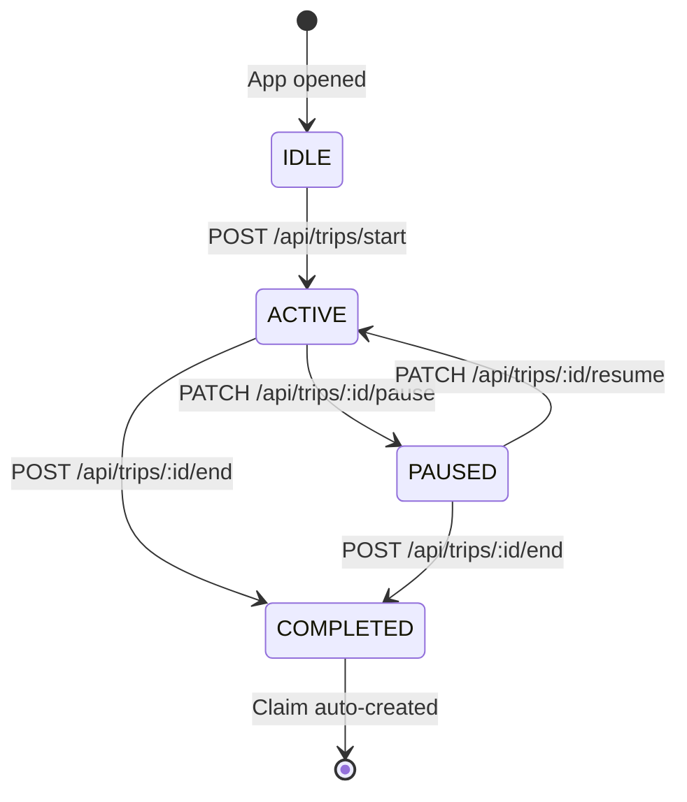
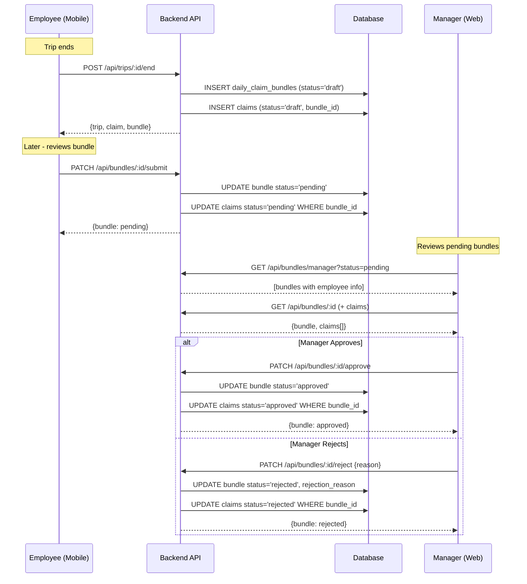

# Sections 8–12: GPS Tracking, Maps, Trips, Expense Engine, Approval Workflow

---

# Section 8: GPS Tracking Module Analysis

## 8.1 Location Collection Architecture

The GPS tracking system uses a **three-layer location pipeline**:

```
Layer 1: Device GPS (expo-location)
    ↓ fetchCurrentLocation() every 15 seconds
Layer 2: Client-side filtering (distance.ts)
    ↓ Ignore: accuracy > 90m, distance < 8m, speed > 45 m/s
Layer 3: Dual persistence
    ├── Socket.IO: location:update (real-time to managers)
    └── REST batch: POST /api/locations/batch (every 4 points)
```

## 8.2 GPS Polling Implementation

```typescript
// FieldOpsContext.tsx
const LOCATION_POLL_MS = 15000;  // 15-second interval
const LOCATION_BATCH_SIZE = 4;   // Flush every 4 points = every 60 seconds

useEffect(() => {
  if (tripStatus !== "active") return;
  void pollLocation();
  locationIntervalRef.current = setInterval(pollLocation, LOCATION_POLL_MS);
}, [tripStatus]);
```

**Sampling rate**: 15 seconds → ~240 points/hour per active trip.  
**Batch upload**: Every 4th point → REST call every ~60 seconds.  
**Real-time**: Every point → Socket.IO immediately.

## 8.3 Client-Side Noise Filtering (`distance.ts`)

| Filter | Threshold | Reason |
|---|---|---|
| Poor accuracy | > 90 meters | Indoor/tunnel GPS reading — discard |
| Jitter (min distance) | < 8 meters | Stationary device noise |
| Speed cap | > 45 m/s (~162 km/h) | GPS coordinate jump / impossible movement |

## 8.4 Server-Side Distance Calculation (`haversine.ts`)

At trip-end, the backend fetches ALL location points for the trip and recalculates distance server-side:

```typescript
// haversine.ts constants
const MIN_SEGMENT_M = 5;    // 5m minimum (tighter than client's 8m)
const MAX_SPEED_MPS = 55;   // 55 m/s = ~198 km/h
const EARTH_RADIUS_M = 6_371_000;

export function calculateDistance(points: GpsPoint[]): DistanceResult {
  // Iterates all consecutive pairs
  // Skips segments < 5m or > 55 m/s
  // Returns: totalKm (3 decimal), avgSpeedKmh, durationSeconds, pointsUsed
}
```

**Why two-level filtering?** Client filtering reduces noise in real-time display and prevents Socket.IO spam. Server filtering provides the **authoritative** calculation used for claim amounts — it cannot be manipulated by a modified client.

## 8.5 Background Tracking Status

| Capability | Status | Notes |
|---|---|---|
| Foreground tracking | ✅ Implemented | 15-sec interval via setInterval |
| Background tracking | ❌ Not implemented | App must stay in foreground |
| Task Manager tracking | ❌ Not implemented | expo-task-manager not installed |

**Critical Gap**: When a user minimizes the FieldOps app mid-trip, location tracking stops. This is a significant limitation for a real field deployment. Implementation requires `expo-task-manager` + `expo-location` background task registration.

## 8.6 Battery Optimization

```typescript
const BATTERY_POLL_MS = 60000;  // Check battery every 60 seconds

// When battery ≤ 20%:
setAlerts(prev => ({ ...prev, lowBattery: true }));
// Alert shown to user, but tracking is NOT automatically paused
```

**Gap**: Low battery alert is UI-only. Recommend automatically pausing GPS upload frequency (e.g., increase interval to 30s) when battery < 20%.

## 8.7 Geofencing

```typescript
// distance.ts
export function isOutsideGeofence(point, center, radiusMeters): boolean {
  return haversineDistanceMeters(point, center) > radiusMeters;
}

// FieldOpsContext: evaluated on every location point
const outside = isOutsideGeofence(point, user.geofenceCenter, user.geofenceRadiusMeters);
setAlerts(prev => ({ ...prev, outsideGeofence: outside }));
```

Geofencing is client-side only — alerts are displayed but not enforced. `geofenceCenter` defaults to `{latitude: 0, longitude: 0}` (disabled) and `geofenceRadiusMeters` defaults to 25,000m.

---

# Section 9: Map Integration Analysis

## 9.1 Mapbox Implementation

**Web Dashboard**: `mapbox-gl` v2.15 is in `web/package.json` but no Mapbox-specific component files were found in the analyzed structure. The dependency is present but implementation may be incomplete in the feature pages.

**Mobile App**: `react-native-maps` 1.20.1 is installed. Map display is present in `DashboardScreen.tsx` and `TripDetailsScreen.tsx` for route visualization.

## 9.2 Route Visualization

The mobile app accumulates GPS points in the `path` state array:
```typescript
setPath(prev => [...prev, point]);  // Grows during active trip
```

This path is passed to the map component to render a polyline. On trip-end, the final route is displayed in `TripDetailsScreen`.

## 9.3 Distance Calculations

All distance calculations use **Haversine** (great-circle distance), not mapping-API-routed distance. This means:
- Distance is "as the crow flies" between consecutive GPS points
- Significantly underestimates road distance for routes with many turns
- For straight highway travel, accuracy is within 2-5%
- **Recommendation**: For urban environments with winding routes, integrate Mapbox Directions API to get road-network distance

---

# Section 10: Trip Management Module

## 10.1 Trip Lifecycle



## 10.2 Trip Start

```
1. Check GPS permission (ensureLocationPermission)
2. Fetch initial location
3. POST /api/trips/start {latitude, longitude}
4. Server: Check for existing active/paused trip (409 if exists)
5. Server: INSERT trip with status='active', started_at=NOW()
6. Client: Store tripId, emit trip:started via Socket.IO
7. Client: Start 15-sec location polling interval
8. Client: Start 1-sec elapsed timer
```

**Conflict prevention**: The server enforces that a user can only have ONE active or paused trip at a time. Any attempt to start while an existing trip is active returns HTTP 409.

## 10.3 Pause/Resume

**Pause**: Sets `status='paused'`, `paused_at=NOW()`. Location polling stops.  
**Resume**: Calculates `(NOW() - paused_at)` in seconds, adds to `pause_duration_seconds`, sets `status='active'`, clears `paused_at`. Location polling restarts.

This allows accurate "active travel time" calculation separate from "total elapsed time".

## 10.4 Trip End (Critical Path)

```
1. Flush remaining location batch to REST API
2. POST /api/trips/:id/end
3. Server: Fetch ALL locations for this trip
4. Server: calculateDistance(locations) → Haversine
5. Server: Update trip: status='completed', total_distance_km, avg_speed_kmh, ended_at
6. Server (compensating pattern):
   a. Upsert daily_claim_bundles for trip date
   b. INSERT claim (status='draft', amount = distance × rate_per_km)
   c. syncBundleTotals(bundleId) → update bundle totals
7. Client: setTripStatus('completed')
8. Client: Fetch updated claims + dashboard stats
```

## 10.5 Compensating Pattern on Trip End

The trip-end handler uses a **compensating transaction pattern** — each step is attempted independently:

```typescript
// trips.router.ts (simplified)
if (distResult.totalKm > 0) {
  // Step 1: Upsert bundle (idempotent)
  const {data: bundle, error: bundleError} = await supabaseAdmin
    .from("daily_claim_bundles").upsert({user_id, claim_date}, {onConflict: "user_id,claim_date"});
  
  if (!bundleError) {
    bundleSynced = true;
    // Step 2: Insert claim
    const {data: claim, error: claimError} = await supabaseAdmin
      .from("claims").insert({...claimData, bundle_id: bundle.id});
    
    if (!claimError) {
      claimSynced = true;
      // Step 3: Sync bundle totals (non-blocking)
      await syncBundleTotals(bundle.id);
    }
  }
}
// Response always returns trip data, even if claim creation failed
res.json({data: {trip, distance, claim, claimSynced, bundleSynced}});
```

This ensures trip completion is never blocked by claim-creation failures. The client can retry claim creation separately.

---

# Section 11: Expense Reimbursement Engine

## 11.1 Policy Configuration

| Policy Parameter | Storage | Current Default |
|---|---|---|
| `rate_per_km` | `public.users.rate_per_km` (per-employee) | ₹10.00/km |
| `global_rate_per_km` | `system_settings.value` | ₹10.00/km |
| `max_speed_kmh` | `system_settings.value` | 200 km/h |
| `gps_interval_sec` | `system_settings.value` | 15 seconds |

Per-employee rate overrides global rate. This allows different reimbursement tiers (e.g., senior staff get ₹12/km, junior staff ₹8/km).

## 11.2 Claim Amount Calculation

```typescript
// trips.router.ts — on trip end
const ratePerKm = req.user!.rate_per_km ?? 10;
const amountInr = Math.round(distResult.totalKm * ratePerKm * 100) / 100;
```

Formula: **Amount = Distance (km) × Rate (₹/km)**, rounded to 2 decimal places.

## 11.3 Claim Status Lifecycle

```
draft    → Created automatically on trip completion
pending  → Employee submits the daily bundle
approved → Manager approves the bundle (cascades to all child claims)
rejected → Manager rejects the bundle (cascades)
```

Individual claim approval/rejection is also possible via `/api/claims/:id/approve|reject`.

## 11.4 Manager Override

When a claim is rejected, a manager can override it:
```
PATCH /api/claims/:id/override { distance_km: 15.5 }
→ New amount = 15.5 × rate_per_km
→ Status = 'pending' (re-enters approval queue)
→ Bundle status reset to 'pending' if it was 'rejected'
```

This is a powerful feature that handles disputes where the GPS tracking may have missed distance (e.g., employee traveled in an area with poor GPS).

## 11.5 Edge Cases Handled

| Edge Case | Handling |
|---|---|
| Zero-distance trip | No claim created (`if (distResult.totalKm > 0)`) |
| Bundle already exists for date | `upsert` with `onConflict: "user_id,claim_date"` |
| Claim creation fails | Trip still completes; `claimSynced: false` returned |
| Employee has no rate_per_km | Falls back to ₹10.00/km default |
| Trip with no location points | `calculateDistance([]) → 0 km` |

---

# Section 12: Approval Workflow

## 12.1 Bundle Approval Flow



## 12.2 Audit Trail

Every approval/rejection records:
- `reviewed_by`: UUID of the manager who took action
- `reviewed_at`: Timestamp of the decision
- `rejection_reason`: Required text for rejections

This provides a complete immutable audit trail for compliance and dispute resolution.

## 12.3 Granular vs Bundle Approval

The system supports **both** granular and bundle-level approval:
- **Bundle approval**: Approves/rejects ALL child claims in one action (common path)
- **Individual claim approval**: `PATCH /api/claims/:id/approve` (for edge cases)
- **Override**: Manager corrects rejected claim with adjusted distance

## 12.4 Gap: No Re-Submission After Rejection

Currently, a rejected bundle is final from the employee's perspective. The employee cannot re-submit a rejected bundle. The only remedy is a manager override of individual claims. **Recommendation**: Add a `re-submit` endpoint that allows employees to add notes and re-submit rejected bundles for manager re-review.
